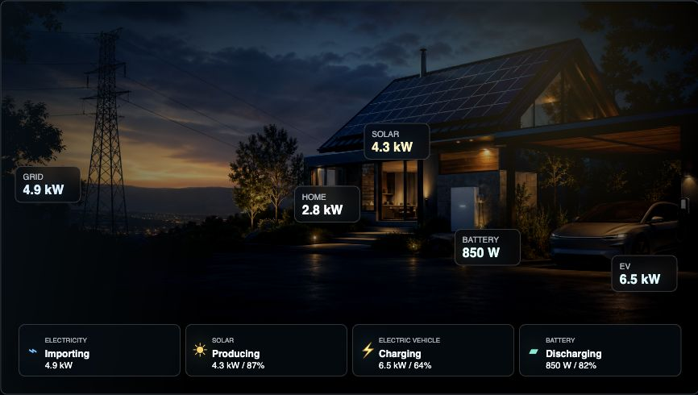
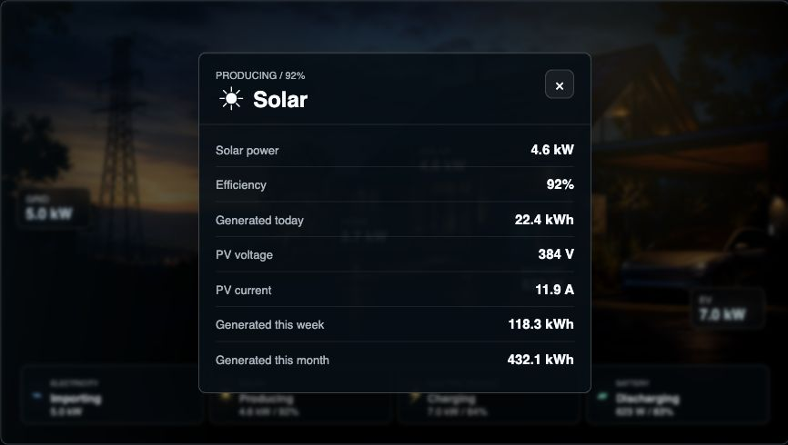

# Energy Home Visual Card

`energy-home-visual-card` is a fullscreen-friendly Home Assistant Lovelace custom card for cinematic energy monitoring. It places animated SVG power-flow lines over a high-quality home energy background and renders live values for grid, solar, house load, EV charging, battery state, and daily energy.





## Features

- LitElement custom card registered as `custom:energy-home-visual-card`.
- Switches between setup-specific backgrounds using `show_ev`, `show_solar`, and `show_battery`.
- Supports day/night background switching from `sun.sun` or another configured entity.
- Supports `show_ev`, `show_solar`, and `show_battery` as booleans or Home Assistant entities.
- Visual card editor support for the main setup options and sensor entity IDs.
- Configurable entity IDs for power, energy summary, battery SOC, EV SOC, EV charging state, and solar efficiency.
- Animated SVG flow overlays for grid, solar, EV, and battery.
- Subtle directional particles show energy transfer without adding more panels.
- Animation speed scales with the current power value.
- Import/export and charge/discharge direction handling.
- Bottom status bar with Electricity, Solar, Electric Vehicle, and Battery pills.
- Tap/click on major elements opens an in-card detail panel with optional extra sensors.
- Uses CSS variables so `card-mod` can override sizing, radius, colors, and shadow.

## Basic Usage

```yaml
type: custom:energy-home-visual-card
show_ev: input_boolean.has_ev
show_solar: input_boolean.has_solar
show_battery: input_boolean.has_battery
solar_capacity_kw: 5
battery_capacity_kwh: 13.5
show_title: false
show_daily_summary: false
show_bottom_bar: true
node_detail: minimal

entities:
  sun: sun.sun
  grid_power: sensor.grid_power_w
  solar_power: sensor.solar_power_w
  house_power: sensor.house_consumption_w
  ev_power: sensor.ev_charging_power_w
  ev_soc: sensor.ev_state_of_charge
  ev_charging_state: binary_sensor.ev_charging
  battery_power: sensor.battery_power_w
  battery_soc: sensor.battery_soc

energy_today:
  grid: sensor.grid_energy_today
  solar: sensor.solar_energy_today
  home: sensor.home_energy_today

detail_entities:
  solar:
    pv_voltage: sensor.solar_pv_voltage
    pv_current: sensor.solar_pv_current
    energy_week: sensor.solar_energy_week
    energy_month: sensor.solar_energy_month
```

The bundled backgrounds load automatically when the card and images are installed together through HACS or from `dist/`. Use `backgrounds` only when you want to override the provided images.

See `docs/setup.md`, `examples/dashboard.yaml`, and `examples/dashboard-no-ev.yaml` for fuller setup snippets.

## Setup Tips

- Start with only `grid_power` and `house_power`; then add solar, EV, and battery sections one at a time.
- Use `show_ev`, `show_solar`, and `show_battery` with booleans for a fixed dashboard, or helper entities for reusable dashboards.
- Keep `show_title: false` and `show_daily_summary: false` for the clean visual layout shown above.
- Add `detail_entities` only for sensors you actually have; missing detail rows are ignored.

## HACS Install

Add this repository as a custom HACS Dashboard/Lovelace repository, then install it:

```text
RoBro92/HACS-home-energy-card
```

The Lovelace resource should be:

```yaml
url: /hacsfiles/HACS-home-energy-card/energy-home-visual-card.js
type: module
```

HACS installs the JavaScript module and bundled background images from `dist/`.

## Config

| Key | Required | Description |
| --- | --- | --- |
| `backgrounds.full.day/night` | No | Images for EV + solar + battery setup. |
| `backgrounds.ev_solar.day/night` | No | Images for EV + solar, with no battery. |
| `backgrounds.ev_battery.day/night` | No | Images for EV + battery, with no solar. |
| `backgrounds.solar_battery.day/night` | No | Images for solar + battery, with no EV/car. |
| `backgrounds.ev_only.day/night` | No | Images for EV only, with no solar or battery. |
| `backgrounds.solar_only.day/night` | No | Images for solar only, with no EV or battery. |
| `backgrounds.battery_only.day/night` | No | Images for battery only, with no EV or solar. |
| `backgrounds.base.day/night` | No | Images for homes without EV, solar, or battery. |
| `background_full` | No | Legacy single full image fallback. |
| `background_no_ev` | No | Legacy no-EV image fallback. |
| `show_ev` | No | Boolean or entity. Entity states `on`, `true`, `home`, `charging`, `plugged_in`, and `connected` show the EV. |
| `show_solar` | No | Boolean or entity. Defaults to visible. |
| `show_battery` | No | Boolean or entity. Defaults to visible. |
| `solar_capacity_kw` | No | Solar install capacity in kW. Used to calculate solar efficiency. |
| `battery_capacity_kwh` | No | Battery capacity in kWh. |
| `show_title` | No | Shows optional top-left title/subtitle text when true. Defaults to false. |
| `show_daily_summary` | No | Shows the top daily kWh summary strip when true. Defaults to false. |
| `show_bottom_bar` | No | Shows the bottom live-status bar when true. Defaults to true. |
| `node_detail` | No | `minimal` shows compact floating nodes. `full` adds status text to nodes. |
| `entities.sun` | No | Sun entity for day/night switching. Defaults to `sun.sun`; falls back to local time if unavailable. |
| `entities.grid_power` | Yes | Current grid power in W. Positive is importing, negative is exporting. |
| `entities.solar_power` | When solar shown | Current solar production in W. |
| `entities.solar_capacity` | No | Sensor alternative to `solar_capacity_kw`. Supports kW or W unit attributes. |
| `entities.house_power` | Yes | Current house consumption in W. |
| `entities.ev_power` | When EV shown | Current EV charging power in W. |
| `entities.ev_soc` | No | EV state of charge percentage. |
| `entities.ev_charging_state` | No | EV charging state or binary sensor. |
| `entities.battery_power` | When battery shown | Current battery power in W. Positive is charging, negative is discharging. |
| `entities.battery_soc` | When battery shown | Battery state of charge percentage. |
| `entities.battery_capacity` | No | Sensor alternative to `battery_capacity_kwh`. Supports kWh or Wh unit attributes. |
| `energy_today.grid` | No | Daily grid energy sensor in kWh. |
| `energy_today.solar` | No | Daily solar energy sensor in kWh. |
| `energy_today.home` | No | Daily home energy sensor in kWh. |
| `detail_entities.<group>.<key>` | No | Extra rows shown in the in-card detail modal. Groups are `grid`, `solar`, `house`, `ev`, and `battery`. |

## Background Selection

The card chooses the background in this order:

1. Setup: `full`, `ev_solar`, `ev_battery`, `solar_battery`, `ev_only`, `solar_only`, `battery_only`, or `base`.
2. Setup aliases: `no_ev` still maps to `solar_battery`, and `no_solar_battery` still maps to `ev_only`.
3. Time: `day` or `night`, based on `entities.sun`, `time_of_day`, or local clock fallback.

## Card-Mod Variables

```yaml
card_mod:
  style: |
    energy-home-visual-card {
      --energy-card-aspect-ratio: 1672 / 941;
      --energy-card-radius: 8px;
      --energy-card-accent: #58d5ff;
      --energy-card-shadow: none;
    }
```

## Release

Run this before tagging a GitHub release for HACS:

```bash
npm run build
npm run check
```

Commit the generated `dist/` folder, push to `RoBro92/HACS-home-energy-card`, then create a version tag such as `v0.1.0`.
