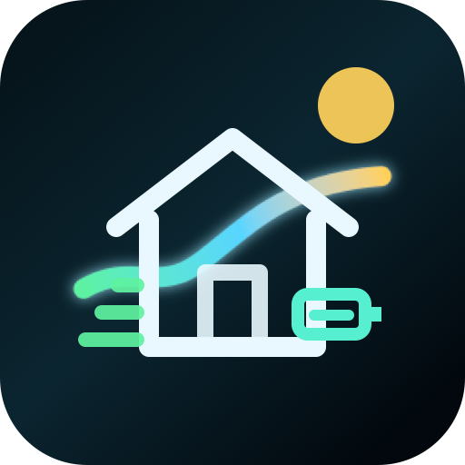
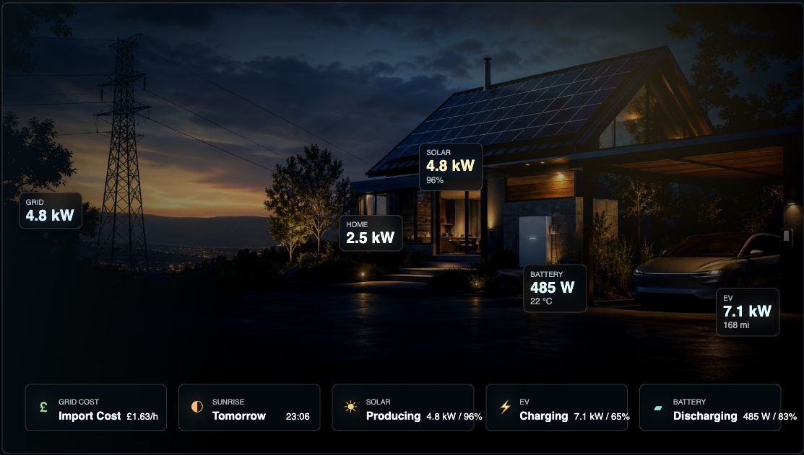
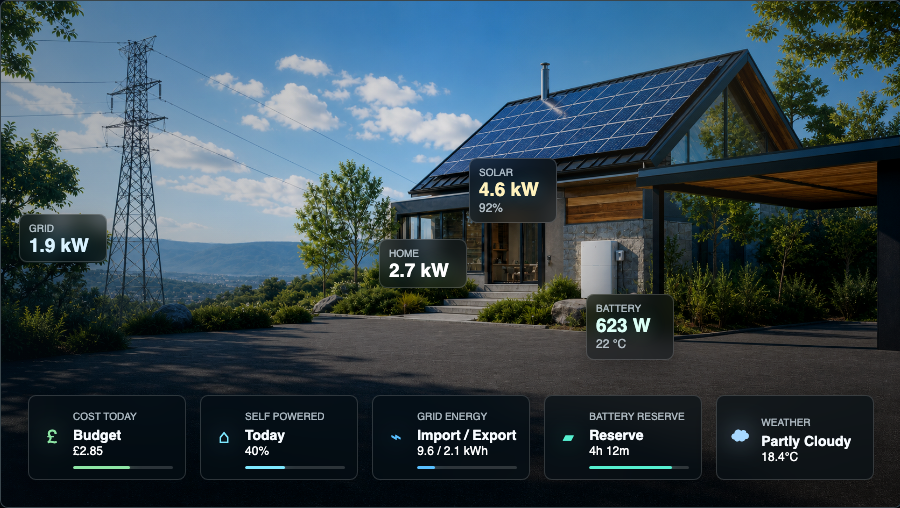
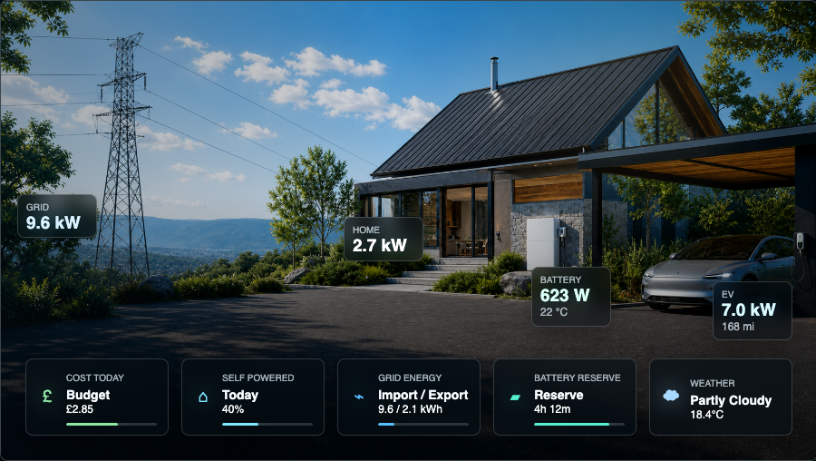
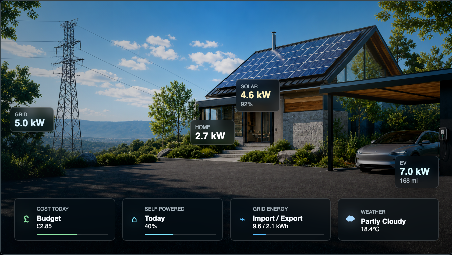
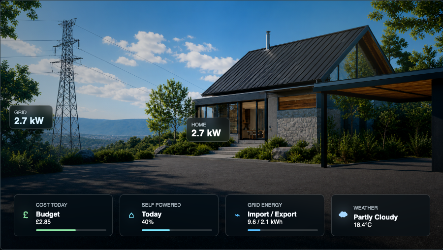

# HACS Home Energy Card

<p align="center">
  
</p>

HACS Home Energy Card is a Home Assistant dashboard card for cinematic home energy monitoring. It shows grid import and export, solar production, home load, EV charging, battery state, day and night backgrounds, animated energy direction, detail panels, and configurable glance cards.

[](https://my.home-assistant.io/redirect/hacs_repository/?owner=RoBro92&repository=HACS-home-energy-card&category=dashboard)


## Public Testing

Public testers can add this as a HACS custom Dashboard repository. Please use the latest release and report install notes through [GitHub Issues](https://github.com/RoBro92/HACS-home-energy-card/issues).

Testing guide:

- [Public testing notes](docs/public-testing.md)
- [Setup guide](docs/setup.md)
- [Brand assets](docs/brand-assets.md)

## Install

Install through HACS as a custom Dashboard repository:

```text
RoBro92/HACS-home-energy-card
```

The Lovelace resource should be:

```yaml
url: /hacsfiles/HACS-home-energy-card/dist/hacs-home-energy-card.js
type: module
```

HACS installs the card and bundled background images automatically. Hard refresh Home Assistant after installing or updating.

## Preview

### Day and Night Cycle

| Day | Night |
| --- | --- |
|  |  |

### Setup Variants

| Full setup | No EV | No solar |
| --- | --- | --- |
|  |  |  |

| No battery | Base home |
| --- | --- |
|  |  |

### Detail Panels


## Features

- LitElement custom card registered as `custom:hacs-home-energy-card`.
- Switches between setup specific backgrounds using `show_ev`, `show_solar`, and `show_battery`.
- Supports day/night background switching from `sun.sun` or another configured entity.
- Supports `show_ev`, `show_solar`, and `show_battery` as booleans or Home Assistant entities.
- Visual card editor support for the main setup options, sizing, and sensor entity IDs.
- Configurable entity IDs for power, energy summary, battery SOC, EV SOC, EV charging state, and solar efficiency.
- Optional pixel width and height settings with minimum size clamping.
- Animated energy paths for grid, solar, EV, and battery.
- Directional pulse markers show energy transfer without adding more panels.
- Animation speed scales with the current power value.
- Import/export and charge/discharge direction handling.
- Bottom status bar with Electricity, Solar, Electric Vehicle, and Battery pills.
- Tap or click on major elements opens an in card detail panel with optional extra sensors.
- Uses CSS variables so Card Mod can override sizing, radius, colors, and shadow.

## Basic Usage

```yaml
type: custom:hacs-home-energy-card
show_ev: input_boolean.has_ev
show_solar: input_boolean.has_solar
show_battery: input_boolean.has_battery
solar_capacity_kw: 5
battery_capacity_kwh: 13.5
show_title: false
show_daily_summary: false
show_bottom_bar: true
node_detail: minimal
card_width: 900
card_height: 506
min_width: 320
min_height: 180

labels:
  grid: Grid
  gridCard: Grid cost
  house: Home
  solar: Solar
  ev: EV
  evCard: EV
  battery: Battery

tariffs:
  currency: £
  import_rate_entity: sensor.current_import_rate
  export_rate_entity: sensor.current_export_rate

bottom_bar:
  - type: cost
    label: Grid cost
  - type: sun
  - solar
  - ev
  - battery

entities:
  sun: sun.sun
  grid_power: sensor.grid_power_w
  solar_power: sensor.solar_power_w
  house_power: sensor.house_consumption_w
  ev_power: sensor.ev_charging_power_w
  ev_soc: sensor.ev_state_of_charge
  ev_charging_state: binary_sensor.ev_charging
  battery_power: sensor.battery_power_w
  battery_soc: sensor.battery_soc

node_info:
  solar:
    entity: sensor.solar_efficiency
  ev:
    entity: sensor.ev_range
  battery:
    entity: sensor.battery_temperature

energy_today:
  grid: sensor.grid_energy_today
  solar: sensor.solar_energy_today
  home: sensor.home_energy_today

detail_entities:
  solar:
    pv_voltage: sensor.solar_pv_voltage
    pv_current: sensor.solar_pv_current
    energy_week: sensor.solar_energy_week
    energy_month: sensor.solar_energy_month
```

The bundled backgrounds load automatically when the card and images are installed together through HACS. Use `backgrounds` only when you want to override the provided images.

## Documentation

The README is a quick start. Detailed setup is split into focused docs and examples:

- [Setup guide](docs/setup.md)
- [Full dashboard example](examples/dashboard.yaml)
- [No EV dashboard example](examples/dashboard-no-ev.yaml)

## Setup Tips

- Start with only `grid_power` and `house_power`; then add solar, EV, and battery sections one at a time.
- Use `show_ev`, `show_solar`, and `show_battery` with booleans for a fixed dashboard, or helper entities for reusable dashboards.
- Keep `show_title: false` and `show_daily_summary: false` for the clean visual layout shown above.
- Leave `card_width` and `card_height` blank for a responsive card, or set pixel values when using a fixed wall panel or kiosk layout.
- Add `detail_entities` only for sensors you actually have; missing detail rows are ignored.
- Use `bottom_bar` to choose glance cards such as grid cost, sunrise/sunset, solar, EV, battery, or any custom entity.

## Config

| Key | Required | Description |
| --- | --- | --- |
| `backgrounds.full.day/night` | No | Images for EV + solar + battery setup. |
| `backgrounds.ev_solar.day/night` | No | Images for EV + solar, with no battery. |
| `backgrounds.ev_battery.day/night` | No | Images for EV + battery, with no solar. |
| `backgrounds.solar_battery.day/night` | No | Images for solar + battery, with no EV/car. |
| `backgrounds.ev_only.day/night` | No | Images for EV only, with no solar or battery. |
| `backgrounds.solar_only.day/night` | No | Images for solar only, with no EV or battery. |
| `backgrounds.battery_only.day/night` | No | Images for battery only, with no EV or solar. |
| `backgrounds.base.day/night` | No | Images for homes without EV, solar, or battery. |
| `background_full` | No | Legacy single full image fallback. |
| `background_no_ev` | No | Legacy no EV image fallback. |
| `show_ev` | No | Boolean or entity. Entity states `on`, `true`, `home`, `charging`, `plugged_in`, and `connected` show the EV. |
| `show_solar` | No | Boolean or entity. Defaults to visible. |
| `show_battery` | No | Boolean or entity. Defaults to visible. |
| `solar_capacity_kw` | No | Solar install capacity in kW. Used to calculate solar efficiency. |
| `battery_capacity_kwh` | No | Battery capacity in kWh. |
| `show_title` | No | Shows optional top left title and subtitle text when true. Defaults to false. |
| `show_daily_summary` | No | Shows the top daily kWh summary strip when true. Defaults to false. |
| `show_bottom_bar` | No | Shows the bottom live status bar when true. Defaults to true. |
| `node_detail` | No | `minimal` shows compact floating nodes. `full` adds status text to nodes. |
| `card_width` | No | Fixed card width in pixels. Leave blank for responsive width. Values below `min_width` are clamped. |
| `card_height` | No | Fixed card height in pixels. Leave blank to keep the configured aspect ratio. Values below `min_height` are clamped. |
| `min_width` | No | Minimum card width in pixels. Defaults to `320`. |
| `min_height` | No | Minimum card height in pixels. Defaults to `180`. |
| `labels.grid/solar/house/ev/battery` | No | Renames floating nodes and detail panel titles. |
| `labels.gridCard/evCard` | No | Renames bottom bar labels where a shorter label is useful. |
| `node_info.<group>.entity` | No | Adds one extra compact value to a floating node. |
| `bottom_bar` | No | Ordered list of bottom cards. Built in types are `grid`, `cost`, `sun`, `solar`, `house`, `ev`, and `battery`; `entity` cards support custom sensors. |
| `tariffs.import_rate/export_rate` | No | Fixed import/export rates per kWh for grid cost calculations. |
| `tariffs.import_rate_entity/export_rate_entity` | No | Dynamic rate sensors for multiple tariff providers. These override fixed rates when available. |
| `tariffs.currency` | No | Currency symbol for grid cost. Defaults to `£`. |
| `actions.<group>[]` | No | Optional Home Assistant service call buttons shown in a detail panel, useful for EV lock or unlock and boost charging. |
| `entities.sun` | No | Sun entity for day/night switching. Defaults to `sun.sun`; falls back to local time if unavailable. |
| `entities.grid_power` | Yes | Current grid power in W. Positive is importing, negative is exporting. |
| `entities.solar_power` | When solar shown | Current solar production in W. |
| `entities.solar_capacity` | No | Sensor alternative to `solar_capacity_kw`. Supports kW or W unit attributes. |
| `entities.house_power` | Yes | Current house consumption in W. |
| `entities.ev_power` | When EV shown | Current EV charging power in W. |
| `entities.ev_soc` | No | EV state of charge percentage. |
| `entities.ev_charging_state` | No | EV charging state or binary sensor. |
| `entities.battery_power` | When battery shown | Current battery power in W. Positive is charging, negative is discharging. |
| `entities.battery_soc` | When battery shown | Battery state of charge percentage. |
| `entities.battery_capacity` | No | Sensor alternative to `battery_capacity_kwh`. Supports kWh or Wh unit attributes. |
| `energy_today.grid` | No | Daily grid energy sensor in kWh. |
| `energy_today.solar` | No | Daily solar energy sensor in kWh. |
| `energy_today.home` | No | Daily home energy sensor in kWh. |
| `detail_entities.<group>.<key>` | No | Extra rows shown in the in card detail modal. Groups are `grid`, `solar`, `house`, `ev`, and `battery`. |

## Background Selection

The card chooses the background in this order:

1. Setup: `full`, `ev_solar`, `ev_battery`, `solar_battery`, `ev_only`, `solar_only`, `battery_only`, or `base`.
2. Setup aliases: `no_ev` still maps to `solar_battery`, and `no_solar_battery` still maps to `ev_only`.
3. Time: `day` or `night`, based on `entities.sun`, `time_of_day`, or local clock fallback.

## Card Mod Variables

Most users should use `card_width`, `card_height`, `min_width`, and `min_height` for sizing. CSS variables remain available for theme level polish:

```yaml
card_mod:
  style: |
    hacs-home-energy-card {
      --energy-card-aspect-ratio: 1672 / 941;
      --energy-card-radius: 8px;
      --energy-card-accent: #58d5ff;
      --energy-card-shadow: none;
    }
```
