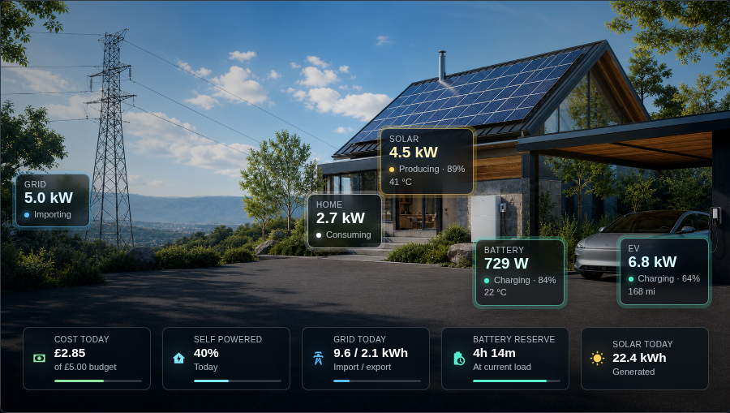
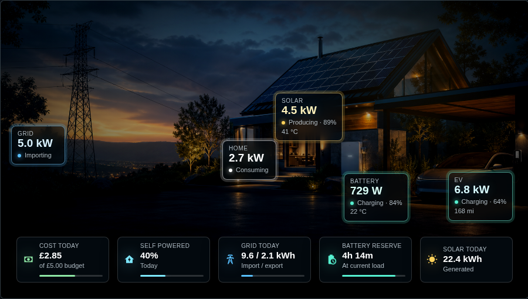
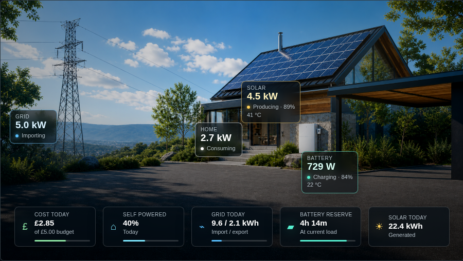
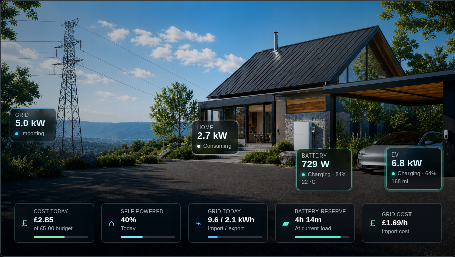
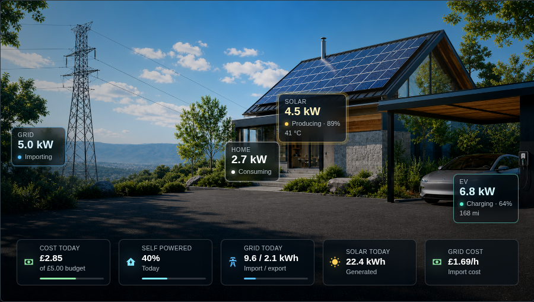
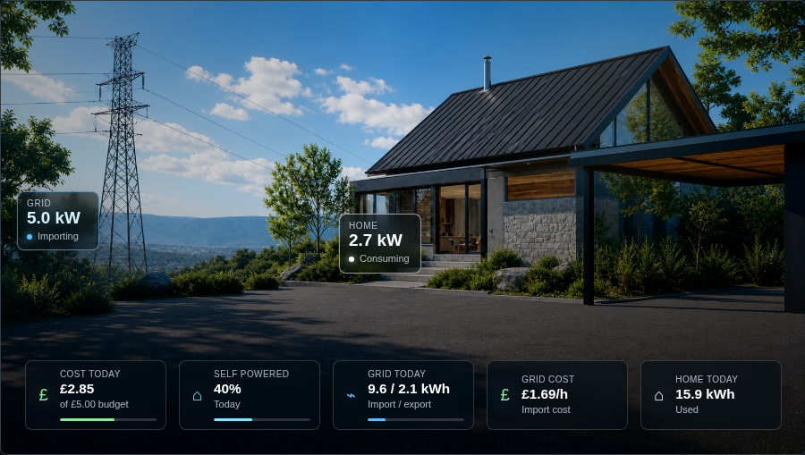
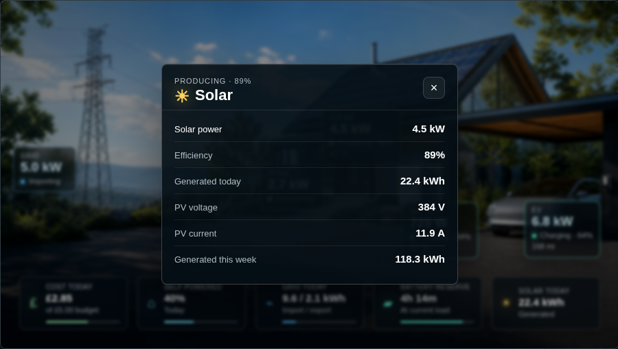

# HACS Home Energy Card

HACS Home Energy Card is a Home Assistant dashboard card for cinematic home energy monitoring. It shows grid import and export, solar production, home load, EV charging, and battery state as floating nodes over a day or night scene, with a bottom bar of energy glance cards and in card detail panels.

[](https://my.home-assistant.io/redirect/hacs_repository/?owner=RoBro92&repository=HACS-home-energy-card&category=dashboard)



## Public Testing

Public testers can add this as a HACS custom Dashboard repository. Please use the latest release and report install notes through [GitHub Issues](https://github.com/RoBro92/HACS-home-energy-card/issues).

Testing guide:

- [Public testing notes](docs/public-testing.md)
- [Setup guide](docs/setup.md)
- [Brand assets](docs/brand-assets.md)

## Install

Install through HACS as a custom Dashboard repository:

```text
RoBro92/HACS-home-energy-card
```

The Lovelace resource should be:

```yaml
url: /hacsfiles/HACS-home-energy-card/HACS-home-energy-card.js
type: module
```

HACS installs the card and bundled background images automatically. Hard refresh Home Assistant after installing or updating.

## Preview

### Day and Night Cycle

| Day | Night |
| --- | --- |
|  |  |

### Setup Variants

| Full setup | No EV | No solar |
| --- | --- | --- |
|  |  |  |

| No battery | Base home |
| --- | --- |
|  |  |

### Detail Panels



## Features

- LitElement custom card registered as `custom:hacs-home-energy-card`.
- Two required sensors. Add the card, pick grid power and home power, and it renders. Solar, battery, and EV are switched on one at a time.
- Picks a matching bundled background for every EV, solar, and battery combination and crossfades between day and night using `sun.sun`.
- Floating nodes show live power with a direction cue: importing or exporting, producing, charging or discharging. Active nodes carry a soft breathing ring.
- Bottom glance bar with up to five energy cards: cost today, grid cost now, tariff now, self powered today, grid import and export, home, solar, EV, and battery daily totals, battery reserve, sunrise and sunset, weather, or any custom entity.
- Tap a node or glance card to open an in card detail panel with optional extra sensors and control buttons.
- Sectioned visual editor. Every option below is available without YAML.
- Respects reduced motion and uses CSS variables so Card Mod can override radius, accent, and shadow.

## Basic Usage

```yaml
type: custom:hacs-home-energy-card
show_ev: true
show_solar: true
show_battery: true
solar_capacity_kw: 5
battery_capacity_kwh: 13.5

entities:
  grid_power: sensor.grid_power_w
  house_power: sensor.house_consumption_w
  solar_power: sensor.solar_power_w
  battery_power: sensor.battery_power_w
  battery_soc: sensor.battery_soc
  ev_power: sensor.ev_charging_power_w
  ev_soc: sensor.ev_state_of_charge
  ev_charging_state: binary_sensor.ev_charging
  weather: weather.home

energy_today:
  grid_import: sensor.grid_import_today
  grid_export: sensor.grid_export_today
  solar: sensor.solar_energy_today
  home: sensor.home_energy_today
  ev: sensor.ev_energy_today
  battery_charge: sensor.battery_charge_today
  battery_discharge: sensor.battery_discharge_today

tariffs:
  currency: £
  import_rate_entity: sensor.current_import_rate
  export_rate_entity: sensor.current_export_rate

costs:
  today_entity: sensor.energy_cost_today
  daily_budget: 5

bottom_bar:
  - type: cost_today
  - type: self_powered_today
  - type: grid_import_export
  - type: battery_reserve
  - type: weather

detail_entities:
  solar:
    - sensor.solar_pv_voltage
    - sensor.solar_pv_current
  ev:
    range: sensor.ev_range
    lock: lock.ev
    boost:
      label: Boost
      entity: switch.ev_boost
      icon: mdi:flash
```

Leave `bottom_bar` out and the card picks the glance cards it has data for. The bundled backgrounds load automatically; use `backgrounds` only to override them.

## Documentation

The README is a quick start. Detailed setup is split into focused docs and examples:

- [Setup guide](docs/setup.md)
- [Full dashboard example](examples/dashboard.yaml)
- [No EV dashboard example](examples/dashboard-no-ev.yaml)

## Setup Tips

- Start with only `grid_power` and `house_power`. The card shows a short hint until both are set, then add solar, battery, and EV one section at a time.
- Use `show_ev`, `show_solar`, and `show_battery` with booleans for a fixed dashboard, or helper entities such as `input_boolean.has_ev` for one card that adapts to several homes.
- Leave `card_width` and `card_height` blank for a responsive card, or set pixel values for a wall panel or kiosk.
- `detail_entities` accepts a plain list of entity IDs. Sensors become rows named after the entity, and lock, switch, button, and input button entities become circular controls. Use the keyed form when you want a custom label or icon.

## Config

| Key | Required | Description |
| --- | --- | --- |
| `entities.grid_power` | Yes | Current grid power in W. Positive is importing, negative is exporting. |
| `entities.house_power` | Yes | Current house consumption in W. |
| `show_solar` / `show_battery` / `show_ev` | No | Boolean or entity. Solar and battery default to on, EV to off. Entity states `on`, `true`, `home`, `charging`, `plugged_in`, and `connected` count as on. |
| `entities.solar_power` | When solar shown | Current solar production in W. |
| `solar_capacity_kw` | No | Array size in kW, used for the efficiency percentage. `entities.solar_capacity` is a sensor alternative in kW or W. |
| `entities.battery_power` | When battery shown | Battery power in W. Positive is charging, negative is discharging. |
| `entities.battery_soc` | When battery shown | Battery state of charge in percent. |
| `battery_capacity_kwh` | No | Battery capacity in kWh, used for the reserve estimate. `entities.battery_capacity` is a sensor alternative in kWh or Wh. |
| `entities.ev_power` | When EV shown | EV charge power in W. Negative values show as vehicle to home. |
| `entities.ev_soc` | No | EV state of charge in percent. |
| `entities.ev_charging_state` | No | EV charging binary sensor or state sensor. |
| `entities.sun` | No | Sun entity for the day and night scene. Defaults to `sun.sun`; falls back to the local clock. |
| `time_of_day` | No | `day`, `night`, or an entity, to lock the scene instead of following the sun. |
| `entities.weather` | No | Weather entity for the `weather` glance card. `entities.outdoor_temperature` can replace its temperature. |
| `energy_today.grid_import` / `grid_export` | No | Daily grid import and export in kWh. Power the `grid_import_export` and `self_powered_today` cards. |
| `energy_today.home` / `solar` / `ev` | No | Daily home, solar, and EV energy in kWh for the `home_today`, `solar_today`, and `ev_today` cards and detail panels. |
| `energy_today.battery_charge` / `battery_discharge` | No | Daily battery charge and discharge in kWh. |
| `energy_today.grid` | No | Net daily grid energy in kWh, shown in the grid detail panel. |
| `tariffs.currency` | No | Currency symbol. Defaults to `£`. |
| `tariffs.import_rate_entity` / `export_rate_entity` | No | Live rate sensors per kWh. Best for time of use tariffs. |
| `tariffs.import_rate` / `export_rate` | No | Fixed rates per kWh, used when no sensor is set. |
| `costs.today_entity` | No | Daily cost sensor for the `cost_today` card. |
| `costs.daily_budget` | No | Optional daily budget that fills the `cost_today` progress bar. |
| `bottom_bar` | No | Ordered list of up to five glance cards. See the table below. |
| `show_bottom_bar` | No | Hide the glance bar with `false`. Defaults to `true`. |
| `labels.grid/house/solar/ev/battery` | No | Renames nodes and detail panel titles. `labels.gridCard` and `labels.evCard` rename the detail panel titles only. |
| `node_info.<group>.entity` | No | One extra compact value on a node, for example inverter temperature or EV range. |
| `detail_entities.<group>` | No | Extra entities for the detail panel as a list of IDs or a keyed map. Groups are `grid`, `solar`, `house`, `ev`, and `battery`. |
| `actions.<group>[]` | No | Custom service call buttons in a detail panel. Simple lock, switch, and button entities can go straight in `detail_entities` instead. |
| `card_width` / `card_height` | No | Fixed size in pixels. Leave blank for a responsive card. `min_width` and `min_height` set the clamps, defaulting to `320` and `180`. |
| `backgrounds.<setup>.day/night` | No | Override the bundled images. Setups are `full`, `ev_solar`, `ev_battery`, `solar_battery`, `ev_only`, `solar_only`, `battery_only`, and `base`. |

### Bottom bar cards

| Type | Shows | Needs |
| --- | --- | --- |
| `cost_today` | Spend so far today, with a budget bar | `costs.today_entity`, optional `costs.daily_budget` |
| `cost_now` | Import cost or export credit per hour | `entities.grid_power` and a tariff rate |
| `tariff_now` | Current import rate, with export as caption | `tariffs.import_rate_entity` or `import_rate` |
| `self_powered_today` | Share of home use not imported | `energy_today.home`, `energy_today.grid_import` |
| `grid_import_export` | Import and export today | `energy_today.grid_import`, `energy_today.grid_export` |
| `home_today` | Home energy used today | `energy_today.home` |
| `solar_today` | Solar generated today | `energy_today.solar` |
| `ev_today` | EV energy charged today | `energy_today.ev` |
| `battery_reserve` | Hours of battery left at the current home load | `entities.battery_soc`, a capacity |
| `battery_charge` | Battery charged today | `energy_today.battery_charge` |
| `battery_discharge` | Battery discharged today | `energy_today.battery_discharge` |
| `sun` | Next sunset or sunrise | `entities.sun` |
| `weather` | Temperature and conditions | `entities.weather` |
| `entity` | Any entity, with `entity`, `label`, optional `status`, `icon`, `color` | the entity |

Solar, EV, and battery cards are dropped automatically when that system is switched off. The legacy `grid`, `solar`, `house`, `ev`, `battery`, and `cost` types still work but duplicate the node values.

## Development

```sh
npm ci
npm run build   # bundles lit into dist/HACS-home-energy-card.js and copies the backgrounds
npm run check   # syntax check and unit tests
```

The source module imports lit as a bare specifier and is bundled by esbuild, so `dist/` is what HACS serves and what `demo/index.html` loads. Commit `dist/` with each release.

## Card Mod Variables

```yaml
card_mod:
  style: |
    hacs-home-energy-card {
      --energy-card-aspect-ratio: 1672 / 941;
      --energy-card-radius: 8px;
      --energy-card-accent: #58d5ff;
      --energy-card-shadow: none;
    }
```
