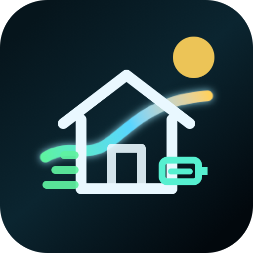

# HACS Home Energy Card

<p align="center">
  
</p>

A cinematic Home Assistant dashboard card for home energy. Live grid, solar, home, battery, and EV power float over a day or night scene, with energy glance cards along the bottom and tap-to-open detail panels.


## Public Testing

Add this repository to HACS as a custom Dashboard repository:

```text
https://github.com/RoBro92/HACS-home-energy-card
```

The dashboard resource should be:

```yaml
url: /hacsfiles/HACS-home-energy-card/HACS-home-energy-card.js
type: module
```

Only grid power and home power are required. Add the card, pick those two sensors in the editor, then switch on solar, battery, and EV as you have them. See `docs/setup.md` for every option.
